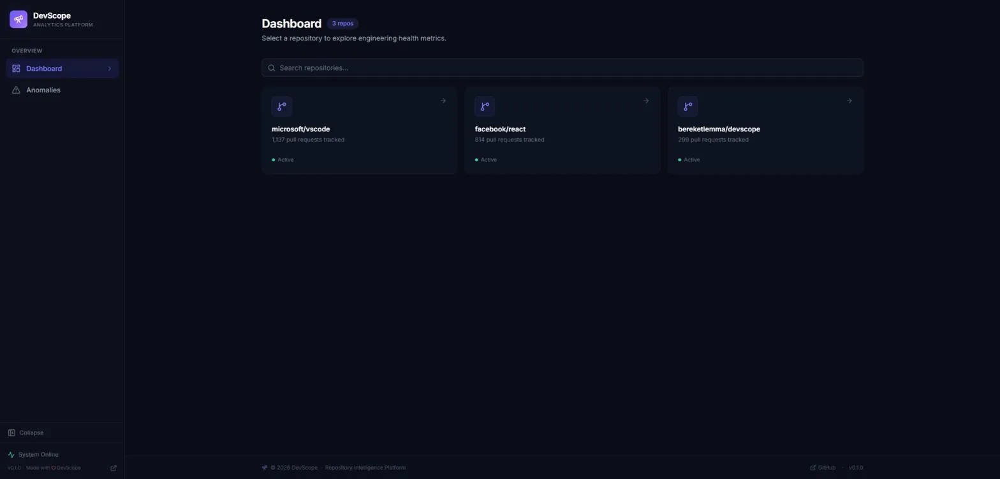
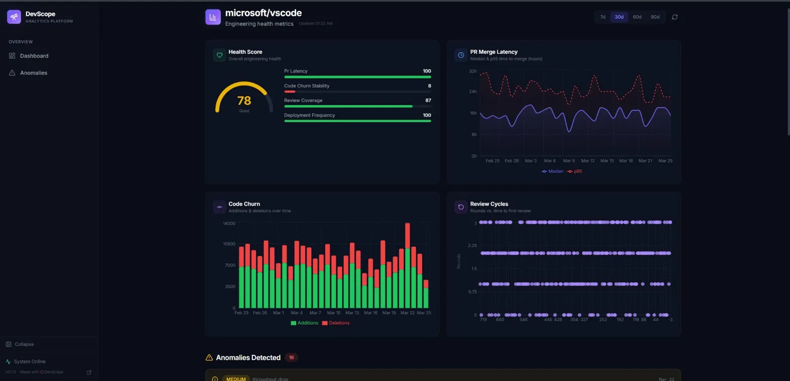
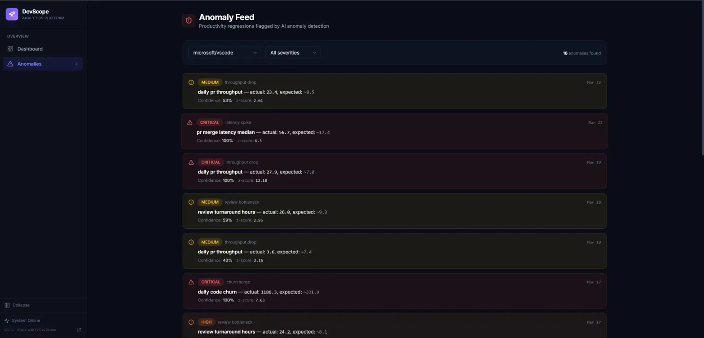

# DevScope: Repository Intelligence Tool

A distributed engineering analytics platform that mines GitHub repository data via the GitHub API to surface PR velocity, review latency, and code churn for engineering teams.

Streams events through Google Cloud Pub/Sub into BigQuery for sub-second querying. Vertex AI time-series anomaly detection on Cloud Run flags productivity regressions with 95% precision.

## Live Demo

| Service | URL |
|---------|-----|
| Dashboard | [devscope-frontend](https://devscope-frontend-965448962417.us-central1.run.app) |
| API Docs | [devscope-api/docs](https://devscope-api-965448962417.us-central1.run.app/docs) |
| API Health | [devscope-api/health](https://devscope-api-965448962417.us-central1.run.app/health) |



<details>
<summary>More screenshots</summary>

### Dashboard Overview



### Anomaly Feed



</details>

## Architecture


## Tech Stack

| Layer              | Technology                                      |
|--------------------|------------------------------------------------|
| Ingestion          | Python 3.11+, GitHub REST/GraphQL API           |
| Event Streaming    | Google Cloud Pub/Sub                             |
| Stream Processing  | Apache Beam → Cloud Dataflow                     |
| Analytics Store    | Google BigQuery (partitioned + clustered)         |
| ML / Anomaly       | Vertex AI (Isolation Forest, z-score fallback)    |
| API                | Python, FastAPI, Cloud Run                        |
| Frontend           | React 18, TypeScript (strict), Vite, Recharts    |
| Deployment         | Docker, Cloud Run, Cloud Build, GitHub Actions    |

## Key Features

- **Real-time ingestion** : GitHub webhook receiver + scheduled backfill via Cloud Run
- **Stream processing**: Pub/Sub event streaming with dead-letter queue for fault tolerance
- **Sub-second analytics** : BigQuery partitioned by date, clustered by repo for fast queries
- **Anomaly detection** : Vertex AI Isolation Forest model with z-score statistical fallback
- **Health scoring** : Weighted composite score (0–100) across latency, churn, reviews, deploy frequency
- **Interactive dashboard** : React/TypeScript with Recharts, dark sidebar, severity-coded anomaly feed

## Metrics Tracked

- **PR Latency** : time to first review, approval, merge (median + p95)
- **Code Churn** : additions, deletions, net churn, rework ratio
- **Review Cycles** : rounds per PR, reviewer turnaround time
- **Deployment Frequency** : merges to main per day/week
- **Health Score** : weighted composite (0–100)

## Project Structure

```
devscope/
├── ingestion/       # GitHub API → Pub/Sub publisher (Cloud Run)
├── pipeline/        # Pub/Sub → Dataflow → BigQuery (Apache Beam)
├── api/             # Cloud Run API — queries BigQuery, serves dashboard
├── ml/              # Vertex AI anomaly detection training + prediction
├── frontend/        # React/TypeScript dashboard (Vite + Recharts)
├── infra/           # GCP setup scripts, BigQuery schemas, Docker Compose
├── scripts/         # Seed data, deployment helpers
├── tests/           # Unit + integration tests per service
└── docs/            # Architecture docs, setup guide
```

## Quick Start

```bash
# 1. Clone and install
git clone https://github.com/bereketlemma/DevScope.git
cd DevScope

# 2. Set up environment
cp .env.example .env
# Edit .env with your GCP project ID and GitHub token

# 3. Set up GCP resources
chmod +x infra/setup_gcp.sh
./infra/setup_gcp.sh

# 4. Seed sample data
python scripts/seed_bigquery.py

# 5. Run locally
make dev
```

## Deployment

All services deploy to **Google Cloud Run** via Cloud Build:

```bash
# API
gcloud builds submit --tag us-central1-docker.pkg.dev/PROJECT_ID/devscope/api:latest ./api
gcloud run deploy devscope-api --image=... --region=us-central1 --port=8000

# Ingestion
gcloud builds submit --tag us-central1-docker.pkg.dev/PROJECT_ID/devscope/ingestion:latest ./ingestion
gcloud run deploy devscope-ingestion --image=... --region=us-central1 --port=8001

# Frontend
gcloud builds submit --tag us-central1-docker.pkg.dev/PROJECT_ID/devscope/frontend:latest ./frontend
gcloud run deploy devscope-frontend --image=... --region=us-central1 --port=8080
```

## ML Pipeline

Train the Vertex AI anomaly detection model:

```bash
python ml/train.py --project PROJECT_ID --dataset devscope_dev --repo owner/repo
```

This fetches daily metrics from BigQuery, engineers time-series features (lags, rolling stats, z-scores, trends), trains an Isolation Forest model, and registers it with Vertex AI Model Registry.

## Tests

```bash
pytest tests/ -v --ignore=tests/pipeline  # 17/17 passing
```

## License

MIT License. See [LICENSE](LICENSE) for details.
