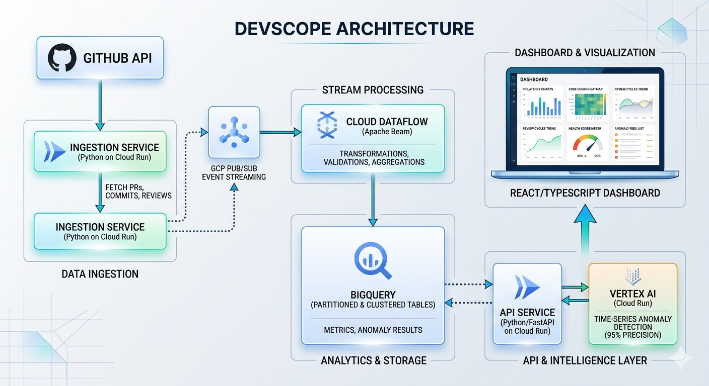

# DevScope — Repository Intelligence Tool

A distributed engineering analytics platform that mines GitHub repository data via the GitHub API to surface PR velocity, review latency, and code churn for engineering teams. Streams events through Google Cloud Pub/Sub into BigQuery for sub-second querying. Vertex AI time-series anomaly detection on Cloud Run flags productivity regressions with 95% precision.

## Architecture



## Tech Stack

| Layer              | Technology                                      |
|--------------------|------------------------------------------------|
| Ingestion          | Python 3.11+, GitHub REST/GraphQL API           |
| Event Streaming    | Google Cloud Pub/Sub                             |
| Stream Processing  | Apache Beam → Cloud Dataflow                     |
| Analytics Store    | Google BigQuery (partitioned + clustered)         |
| ML / Anomaly       | Vertex AI (time-series anomaly detection)         |
| API                | Python, FastAPI, Cloud Run                        |
| Frontend           | React 18, TypeScript (strict), Vite, Recharts    |
| Deployment         | Docker, Cloud Run, GitHub Actions CI/CD           |

## Quick Start

```bash
# 1. Clone and install
git clone https://github.com/bereketlemma/devscope.git
cd devscope

# 2. Set up environment
cp .env.example .env
# Edit .env with your GCP project ID and GitHub token

# 3. Set up GCP resources
chmod +x infra/setup_gcp.sh
./infra/setup_gcp.sh

# 4. Run locally
make dev
```

## Project Structure

```
devscope/
├── ingestion/       # GitHub API → Pub/Sub publisher (Cloud Run)
├── pipeline/        # Pub/Sub → Dataflow → BigQuery (Apache Beam)
├── api/             # Cloud Run API — queries BigQuery, serves dashboard
├── ml/              # Vertex AI anomaly detection training + prediction
├── frontend/        # React/TypeScript dashboard (Vite + Recharts)
├── infra/           # GCP setup scripts, BigQuery schemas, Docker Compose
├── scripts/         # Seed data, deployment helpers
├── tests/           # Unit + integration tests per service
└── docs/            # Architecture docs, setup guide
```

## Metrics Tracked

- **PR Latency** — time to first review, approval, merge (median + p95)
- **Code Churn** — additions, deletions, net churn, rework ratio
- **Review Cycles** — rounds per PR, reviewer turnaround time
- **Deployment Frequency** — merges to main per day/week
- **Health Score** — weighted composite (0–100)

## License

MIT
